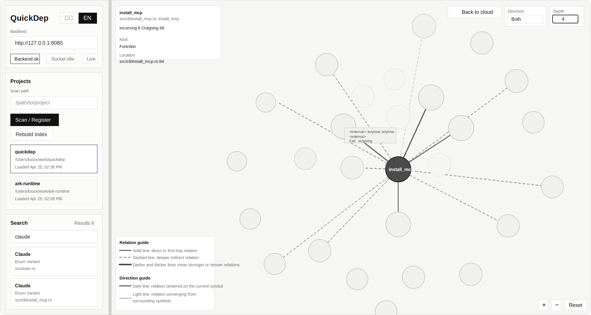

<p align="right">
  <a href="./README.zh-CN.md">简体中文</a>
</p>

# QuickDep

> Help agents narrow the codebase first, then read the right code.


QuickDep turns a repository into a queryable symbol and dependency graph that both humans and agents can use.
Instead of making Claude, Codex, or your own tooling grep a large codebase blindly, QuickDep narrows the search space first and answers structural questions like:

- What calls this function?
- What depends on this interface?
- What is the shortest call path between two symbols?
- Which file owns these related declarations?

It runs locally, persists graph data in SQLite, updates incrementally, and exposes the result through MCP, HTTP, WebSocket, and a local web UI.
QuickDep is MIT licensed and designed for real coding workflows where agents need to find the right files before they can reason correctly.

## Web UI



The web UI is a local visual console for people who want to inspect project state and dependency graphs directly in the browser.
The left side is operational: backend address, project registration, project switching, and symbol search.
The right side is visual: project-level relation cloud, symbol-level dependency graph, zoom, depth control, and direction filtering.

### Start the web UI

1. Start QuickDep with HTTP enabled:

   ```bash
   quickdep --http 8080 --http-only
   ```

2. Start the frontend:

   ```bash
   cd web
   npm install
   npm run dev
   ```

3. Open the local address printed by Vite, usually `http://127.0.0.1:5173`.

### Use the web UI

1. Confirm the backend field points to `http://127.0.0.1:8080`
2. Paste a local repository path into `Scan path`, then click `Scan / Register`
3. Pick the indexed project from `Projects`
4. Use `Search` to find a function, method, or type
5. Click a result to open its dependency graph
6. Use `Direction` and `Depth` in the top-right corner to change the graph scope
7. Click `Back to cloud` to return to the project-wide relation view
8. Use the `+`, `-`, and `Reset` controls in the bottom-right corner to zoom and recenter

The browser UI does not require editing `quickdep.toml`.
It talks to the same local QuickDep HTTP service that MCP clients and API consumers use.

## The Question QuickDep Answers Better Than grep

**"What breaks if I change `helper()`?"**

`grep` can show where `helper` appears.
QuickDep tells you who **calls** it, what **depends** on it, and how the **impact chain** fans out across the repository.

```text
get_dependencies("helper", direction="incoming")
```

That is the core value proposition: not more text hits, but a better first suspect list.

## Why QuickDep

Most code agents still reconstruct architecture from raw text search.
The real problem is not just token cost. It is that agents waste time reading the wrong files and manually filtering noisy grep results before they even reach the likely cause.

QuickDep precomputes the code graph once, keeps it warm as files change, and gives agents a fast structural narrowing layer for:

- refactor planning and impact analysis
- symbol lookup without brute-force search
- call-chain tracing across files and modules
- local code exploration through CLI, API, or web UI

If you want an LLM to answer "what should I inspect first?" with something better than guesswork, this is the missing layer.

## Claude Benchmark Rerun

We rebuilt the Claude benchmark around real agent workflows and completed the current 4-wave rerun:

1. verify whether Claude picks the right QuickDep high-level entry point first
2. run 4 core benchmark scenarios on `ark-runtime`
3. test no-anchor, editor-context, and incremental-update developer-flow cases
4. run a cross-language sanity round on `tokio`, `nest`, `gin`, `requests`, and `fmt`

The current benchmark entry points are:

- [docs/EXPERIMENT_PLAN.md](docs/EXPERIMENT_PLAN.md)
- [docs/EXPERIMENT_RUNBOOK.md](docs/EXPERIMENT_RUNBOOK.md)
- [docs/EXPERIMENT_REPORT.md](docs/EXPERIMENT_REPORT.md)

All public claims should come from these 3 documents, not from the deleted benchmark set.

## Good Fit

- Agent-assisted development with Claude Code, Codex, or OpenCode
- Large local repositories where text search is too noisy
- Refactors, migrations, and dependency-aware code review
- Building your own code intelligence workflow on top of MCP or HTTP

## Supported Languages

QuickDep currently supports these languages in the local graph pipeline:

| Language | Notes |
| --- | --- |
| Rust | `rs` |
| TypeScript | `ts`, `tsx` |
| JavaScript | `js`, `jsx`, `mjs`, `cjs` |
| Java | `java` |
| C# | `cs` |
| Kotlin | `kt`, `kts` |
| PHP | `php`, `phtml` |
| Ruby | `rb`, `rake` |
| Swift | `swift` |
| Objective-C | `m` |
| Python | `py`, `pyi` |
| Go | `go` |
| C | `c`, `h` |
| C++ | `cc`, `cpp`, `cxx`, `hh`, `hpp`, `hxx` |

## Current Operator Guidance

The current evidence-backed guidance is more specific than "always use QuickDep first":

1. Use QuickDep first for cross-file workflow, impact, call-chain, no-anchor triage, and editor-context questions
2. Pair QuickDep with a small amount of native code reading when behavior details matter
3. Treat single-symbol boundary questions differently: native tools are still competitive or better there today, while QuickDep mainly helps by reducing blind raw-code reading
4. Treat dead-code and deletion questions as a verification workflow: QuickDep can surface "no static callers found" candidates, and `get_verification_context` can package the next checks, but it is not a standalone deletion judge

That is what the completed rerun currently supports. The benchmark does not support the stronger claim that QuickDep already makes every question faster or better.

## What QuickDep Does Not Decide Alone

QuickDep is strongest when the question is:

- what should I inspect first
- what depends on this symbol
- what is the likely impact surface
- which files are structurally related

It is not enough on its own for questions like:

- can I safely delete this symbol
- is this definitely dead code
- does runtime behavior prove this path is unused

Why not:

- QuickDep's strongest evidence is still static structure
- many real projects rely on dynamic registration, framework conventions, event wiring, or string-based dispatch
- `incoming = 0` means "no static callers found", not "safe to delete"

For deletion or dead-code cleanup, the safe workflow is:

1. Use QuickDep to narrow the candidate set
2. Use `get_verification_context` on the suspicious symbol to inspect `assessment`, `dynamic_risk`, `verification_hints`, and related files
3. Use text search to catch non-graph references
4. Read the small number of likely files
5. Confirm with tests or compilation before removing code

## QuickDep vs Common Alternatives

| Tool | MCP-native | Local-first setup | Graph traversal | Impact-oriented queries |
| --- | --- | --- | --- | --- |
| `grep` / `rg` | No | Yes | No | No |
| LSP "find references" | No | Yes | Weak | Weak |
| Sourcegraph-style code intelligence | No | Mixed | Partial | Partial |
| **QuickDep** | **Yes** | **Yes** | **Yes** | **Yes** |

QuickDep is built specifically for local MCP agents that need dependency and call-chain answers, not just symbol search.

## Install And Connect

As of `2026-04-27`, the verified install picture is:

| Method | Current status | Verification result |
| --- | --- | --- |
| `cargo install --path .` | Available | Works for local source installs; `quickdep --version` reflects the checked-out branch version |
| `quickdep install-mcp claude` | Available | Verified and visible in `claude mcp list` |
| `quickdep install-mcp codex` | Available | Verified and visible in `codex mcp list` |
| `quickdep install-mcp opencode` | Available | Verified and visible in `opencode mcp list` |
| GitHub Release | Published | Public releases are available on `embedclaw/QuickDep`; latest public release is `v0.1.3` |
| Homebrew | Not published | Tap / formula are not publicly available yet |
| npm | Not published | `npm view @embedclaw/quickdep` currently returns `E404` |

If you want the lowest-friction path today, prefer the GitHub Release first. If you are developing locally or want the checked-out branch build:

```bash
cargo install --path .
quickdep --version
```

Then wire it into your agent client:

```bash
quickdep install-mcp claude
quickdep install-mcp codex
quickdep install-mcp opencode
```

If you want Claude Code, Codex, or OpenCode to do the install for you, use this copy-paste prompt:

- [docs/AGENT_INSTALL_PROMPT.md](docs/AGENT_INSTALL_PROMPT.md)

Verify that the local service is alive:

```bash
# terminal 1
quickdep --http 8080 --http-only

# terminal 2
curl http://127.0.0.1:8080/health
# {"status":"ok"}
```

More distribution and integration details:

- [docs/INTEGRATIONS.md](docs/INTEGRATIONS.md)

## 30-Second Start and Verify

QuickDep defaults to `serve`, so `quickdep` starts the local stdio MCP server immediately:

```bash
# Start local stdio MCP in the current workspace
quickdep

# Start MCP stdio + HTTP on localhost:8080
quickdep --http 8080

# HTTP only
quickdep --http 8080 --http-only
```

If you want a fast health check before wiring it into an MCP client:

```bash
# run this from another terminal after starting QuickDep with HTTP enabled
curl http://127.0.0.1:8080/health
# {"status":"ok"}
```

Optional local web console:

```bash
cd web
npm install
npm run dev
```

The HTTP server exposes:

- streamable MCP at `/mcp`
- REST endpoints under `/api`
- project status updates at `/ws/projects`
- health checks at `/health`

## Example Questions QuickDep Can Answer

| You want to know | QuickDep surface |
| --- | --- |
| What calls `helper()`? | `get_dependencies` with `incoming` |
| What does this symbol depend on? | `get_dependencies` with `outgoing` |
| How do `entry` and `helper` connect? | `get_call_chain` |
| What interfaces live in one file? | `get_file_interfaces` |
| Is this really a cleanup candidate? | `get_verification_context` |
| Can I browse this visually? | local web UI in [`web/`](web) |

## What Ships Today

- Tree-sitter parsers for Rust, TypeScript/JavaScript, Java, C#, Kotlin, PHP, Ruby, Swift, Objective-C, Python, Go, C, and C++
- SQLite-backed graph storage with WAL mode and FTS5-backed symbol search
- Incremental scanning with file watching, debounce, and pause/resume behavior
- MCP server with project, symbol, dependency, call-chain, and verification-oriented evidence tools
- HTTP API plus WebSocket status streaming
- Local web UI for project state, search, graph view, tables, and batch queries
- Agent installers for Claude Code, Codex, and OpenCode
- Tool filtering with `--tools` for tighter deployments

## What Makes It Attractive

- Local-first: your code stays on your machine
- Agent-native: built to be consumed by MCP clients, not retrofitted later
- Fast to adopt: install the binary, run `install-mcp`, start querying
- Practical surfaces: CLI for scripts, HTTP for integrations, web UI for humans
- Open and permissive: MIT licensed

## CLI Snapshot

```bash
quickdep [OPTIONS] [COMMAND]
```

Key commands:

- `serve`
- `scan <path>`
- `status <path>`
- `debug <path> --stats`
- `debug <path> --deps <interface>`
- `debug <path> --file <relative-path>`
- `install-mcp <claude|codex|opencode>`

Useful server flags:

- `--http <port>`
- `--http-only`
- `--tools <tool1,tool2,...>`
- `--log-level <trace|debug|info|warn|error>`

## Docs

- [docs/USAGE.md](docs/USAGE.md)
- [docs/API.md](docs/API.md)
- [docs/INTEGRATIONS.md](docs/INTEGRATIONS.md)
- [docs/QUICKDEP_PLAIN_LANGUAGE_GUIDE.md](docs/QUICKDEP_PLAIN_LANGUAGE_GUIDE.md)
- [docs/TEST_REPORT.md](docs/TEST_REPORT.md)
- [web/README.md](web/README.md)
- [CHANGELOG.md](CHANGELOG.md)

## Development

```bash
cargo test
cargo clippy --all-targets --all-features -- -D warnings
```

## License

MIT. Use it, fork it, ship it.
