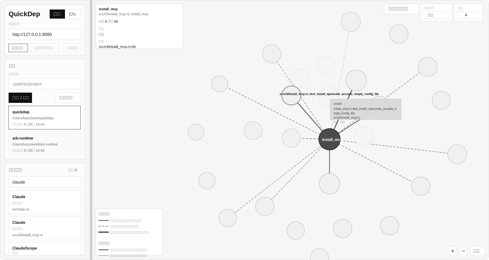

<p align="right">
  <a href="./README.md">English</a>
</p>

# QuickDep

> 让 Agent 在大仓库里先缩小范围，再读源码。


QuickDep 会把一个代码仓库预处理成可查询的符号和依赖图，让人和 Agent 都能直接消费。
它解决的不是“搜到几段文本”，而是“先把搜索空间缩小，再拿到结构化关系”：

- 谁在调用这个函数？
- 改这个接口会影响哪些地方？
- 两个符号之间最短调用链是什么？
- 一个文件里到底声明了哪些关键接口？

它完全本地运行，把图数据存进 SQLite，支持增量更新，并通过 MCP、HTTP、WebSocket 和本地 Web UI 暴露出来。
QuickDep 采用 MIT 开源协议，定位就是一个能直接放进真实开发流程的工程工具，让 Agent 在开始深入阅读源码之前，先找到更可能有问题的那几处代码。

## Web UI



Web UI 是给人直接在浏览器里看项目状态和依赖关系图的本地控制台。
左侧负责操作：配置后端地址、注册项目、切换项目、搜索接口。
右侧负责观察：看项目云图、查看单个接口的局部依赖图、调节方向和深度、缩放和回到全局。

### 如何启动 Web UI

1. 先启动带 HTTP 的 QuickDep：

   ```bash
   quickdep --http 8080 --http-only
   ```

2. 再启动前端：

   ```bash
   cd web
   npm install
   npm run dev
   ```

3. 打开 Vite 打印出来的本地地址，通常是 `http://127.0.0.1:5173`。

### 如何使用 Web UI

1. 确认左上角 `后端地址` 是 `http://127.0.0.1:8080`
2. 在 `扫描路径` 输入一个本地仓库绝对路径，然后点击 `扫描 / 注册`
3. 在 `项目` 列表里选中你要分析的仓库
4. 在 `搜索接口` 输入函数、方法、类型名
5. 点击搜索结果，右侧会切到该接口的依赖图
6. 用右上角的 `依赖方向` 和 `深度` 控制图的范围
7. 点击 `返回项目云图` 回到整个项目的关系云图
8. 用右下角的 `+`、`-`、`还原` 控制缩放和视图复位

Web UI 不需要你为了浏览页面去手动编辑 `quickdep.toml`。
它直接连接本地 QuickDep HTTP 服务，和 MCP 客户端、脚本、API 用的是同一套数据。

## QuickDep 比 grep 更擅长回答的问题

**“如果我改了 `helper()`，到底会影响谁？”**

`grep` 能告诉你 `helper` 在哪里出现过。
QuickDep 能告诉你谁**调用**它、谁**依赖**它，以及这条**影响链**会怎样沿着仓库继续扩散。

```text
get_dependencies("helper", direction="incoming")
```

这就是它最核心的价值：不是更多文本命中，而是更好的“第一批怀疑对象”。

## 项目价值

现在很多 Agent 处理代码时，本质上还是在做“高级版全文检索”。
真正的问题不只是 token，而是它们往往要先读错很多文件，才能慢慢靠近真正相关的代码区域。

这会带来几个很实际的问题：

- 上下文太碎，跨文件关系难以稳定恢复
- token 浪费在盲搜和重复读取上
- 影响分析常常靠猜，不够可验证

QuickDep 的价值就是先把仓库变成一层结构化收敛层，再让 Agent 去问：

- 重构前先看依赖影响面
- 修改接口前先看入边和出边
- 跨模块定位调用链
- 用统一的本地图谱服务支撑 CLI、脚本、Web 和 Agent

如果你希望 LLM 先回答“我应该先看哪几处代码”，而不是在一大堆 grep 结果里盲猜，QuickDep 就是中间那一层。

## Claude 实验重跑结果

我们已经围绕 Claude 的真实使用方式完成了这一轮 4 波重跑：

1. 先验证 Claude 会不会选对 QuickDep 的高层入口
2. 再在 `ark-runtime` 上做 4 个核心场景 benchmark
3. 再验证无锚点、编辑器上下文、增量更新这类真实开发流问题
4. 再在 `tokio`、`nest`、`gin`、`requests`、`fmt` 上补一轮跨语言 sanity

当前实验入口见：

- [docs/EXPERIMENT_PLAN.md](docs/EXPERIMENT_PLAN.md)
- [docs/EXPERIMENT_RUNBOOK.md](docs/EXPERIMENT_RUNBOOK.md)
- [docs/EXPERIMENT_REPORT.md](docs/EXPERIMENT_REPORT.md)

新的对外结论只从这 3 份文档里产出，不再引用旧实验体系。

## 适用场景

- Claude Code、Codex、OpenCode 这类 Agent 驱动开发
- 中大型本地仓库，全文搜索噪音已经很高
- 重构、迁移、依赖梳理、影响分析
- 想基于 MCP 或 HTTP 自己做代码智能工作流

## 当前支持语言

QuickDep 当前已经接入到本地图谱流水线的语言如下：

| 语言 | 典型扩展名 |
| --- | --- |
| Rust | `rs` |
| TypeScript | `ts`, `tsx` |
| JavaScript | `js`, `jsx`, `mjs`, `cjs` |
| Java | `java` |
| C# | `cs` |
| Kotlin | `kt`, `kts` |
| PHP | `php`, `phtml` |
| Ruby | `rb`, `rake` |
| Swift | `swift` |
| Objective-C | `m` |
| Python | `py`, `pyi` |
| Go | `go` |
| C | `c`, `h` |
| C++ | `cc`, `cpp`, `cxx`, `hh`, `hpp`, `hxx` |

## 当前操作建议

基于当前已经写入报告的 Claude 重跑结果，更准确的操作建议是：

1. 对跨文件 workflow、影响分析、调用链、无锚点排查、编辑器上下文问题，优先让 QuickDep 先做结构化收敛
2. 行为细节仍然要配合少量原生读码确认
3. 对“理解某一个局部函数 / 方法边界”这类问题，原生工具今天依然可能更直接；QuickDep 在这类场景里的主要价值是减少盲读源码，而不是已经全面胜出
4. 对“这段代码能不能删”这类问题，要把 QuickDep 当成候选发现和验证入口，而不是最终裁决器

这才是当前数据真正支撑的结论。本轮实验并不支持“QuickDep 已经让所有问题都更快、更好”这种更强说法。

## 哪些问题不能只靠 QuickDep 下结论

QuickDep 最擅长回答的是：

- 我应该先看哪里
- 谁在依赖这个符号
- 这次修改最可能影响哪里
- 哪几个文件在结构上最相关

但下面这些问题，不能只靠 QuickDep 一步下结论：

- 这段代码是不是一定没人用了
- 这个符号是不是一定可以删除
- 某条运行时路径是不是已经彻底废弃

原因是：

- QuickDep 当前最强的证据仍然是静态结构关系
- 很多真实项目会用动态注册、框架约定、事件订阅、字符串分发这类方式
- `incoming = 0` 的真实含义只是“当前静态图里没发现调用者”，不是“可以安全删除”

所以在清理死代码或删除候选时，推荐工作流应该是：

1. 先用 QuickDep 缩小候选范围
2. 再用 `get_verification_context` 看 `assessment`、`dynamic_risk`、`verification_hints` 和相关文件
3. 再用全文搜索补图谱之外的引用
4. 再读少量关键文件确认设计意图
5. 最后用编译和测试确认删除安全性

## QuickDep 和常见方案的区别

| 工具 | MCP 原生 | 本地优先 | 图遍历 | 影响分析查询 |
| --- | --- | --- | --- | --- |
| `grep` / `rg` | 否 | 是 | 否 | 否 |
| LSP 的 find references | 否 | 是 | 弱 | 弱 |
| Sourcegraph 一类代码智能工具 | 否 | 混合 | 部分支持 | 部分支持 |
| **QuickDep** | **是** | **是** | **是** | **是** |

QuickDep 的定位不是替代所有代码工具，而是给本地 MCP Agent 补上一层依赖图和调用链收敛能力。

## 安装与接入

截至 `2026-04-27`，当前实际可用的安装情况如下：

| 方式 | 当前状态 | 我们的验证结果 |
| --- | --- | --- |
| `cargo install --path .` | 已可用 | 适合本地源码安装；`quickdep --version` 会反映当前检出的分支版本 |
| `quickdep install-mcp claude` | 已可用 | 已实测写入成功，`claude mcp list` 显示已连接 |
| `quickdep install-mcp codex` | 已可用 | 已实测写入成功，`codex mcp list` 可见 |
| `quickdep install-mcp opencode` | 已可用 | 已实测写入成功，`opencode mcp list` 显示已连接 |
| GitHub Release | 已发布 | `embedclaw/QuickDep` 已有公开 Release，当前最新公开版本是 `v0.1.3` |
| Homebrew | 未发布 | tap / formula 还没有公开可用 |
| npm | 未发布 | `npm view @embedclaw/quickdep` 当前返回 `E404` |

如果你今天只想用最省事的公开安装方式，优先使用 GitHub Release。  
如果你正在本地开发或者希望安装当前检出的源码版本，直接用：

```bash
cargo install --path .
quickdep --version
```

然后一条命令接进 Agent：

```bash
quickdep install-mcp claude
quickdep install-mcp codex
quickdep install-mcp opencode
```

如果你想把安装动作直接交给 Claude Code / Codex / OpenCode，可以把这份提示词原样贴给它：

- [docs/AGENT_INSTALL_PROMPT.md](docs/AGENT_INSTALL_PROMPT.md)

先验证本地服务正常：

```bash
# 终端 1
quickdep --http 8080 --http-only

# 终端 2
curl http://127.0.0.1:8080/health
# {"status":"ok"}
```

更多分发和集成说明见：

- [docs/INTEGRATIONS.md](docs/INTEGRATIONS.md)

## 30 秒启动与验证

QuickDep 默认子命令就是 `serve`，所以直接运行即可启动本地 `stdio MCP`：

```bash
# 在当前目录启动本地 stdio MCP
quickdep

# 同时暴露 MCP stdio 和 HTTP
quickdep --http 8080

# 仅启用 HTTP
quickdep --http 8080 --http-only
```

如果你想在接入 MCP 前先做一个最快速的活性检查：

```bash
# 先在另一个终端启动带 HTTP 的 QuickDep，再执行这里
curl http://127.0.0.1:8080/health
# {"status":"ok"}
```

可选的本地 Web 控制台：

```bash
cd web
npm install
npm run dev
```

HTTP 服务会提供：

- `/mcp`：streamable MCP
- `/api`：REST API
- `/ws/projects`：项目状态推送
- `/health`：健康检查

## QuickDep 能回答什么

| 你想知道什么 | 对应能力 |
| --- | --- |
| 谁在调用 `helper()`？ | `get_dependencies` 的 `incoming` |
| 这个符号依赖了什么？ | `get_dependencies` 的 `outgoing` |
| `entry` 和 `helper` 怎么连起来？ | `get_call_chain` |
| 一个文件里有哪些接口？ | `get_file_interfaces` |
| 这段代码到底是不是清理候选？ | `get_verification_context` |
| 能不能直接图形化查看？ | [`web/`](web) 本地 Web UI |

## 当前已经交付的内容

- Rust、TypeScript/JavaScript、Java、C#、Kotlin、PHP、Ruby、Swift、Objective-C、Python、Go、C、C++ 的 Tree-sitter 解析
- 基于 SQLite 的图存储，开启 WAL，支持 FTS5 符号搜索
- 增量扫描、文件监控、防抖、暂停/恢复
- MCP 服务，提供项目、符号、依赖、调用链和验证证据包工具
- HTTP API 和 WebSocket 状态流
- 本地 Web UI，可查看项目状态、搜索、依赖图、表格和批量查询
- Claude Code、Codex、OpenCode 的一键 `install-mcp`
- `--tools` 级别的工具裁剪能力

## 吸引人的点

- 本地优先：代码不出机器
- 面向 Agent：不是后补的接口层，而是从 MCP 使用场景反推设计
- 上手快：装好二进制，执行 `install-mcp`，马上就能用
- 入口完整：CLI、HTTP、Web UI 都有
- MIT 开源：可直接集成、二开、商用友好

## CLI 概览

```bash
quickdep [OPTIONS] [COMMAND]
```

核心命令：

- `serve`
- `scan <path>`
- `status <path>`
- `debug <path> --stats`
- `debug <path> --deps <interface>`
- `debug <path> --file <relative-path>`
- `install-mcp <claude|codex|opencode>`

常用服务参数：

- `--http <port>`
- `--http-only`
- `--tools <tool1,tool2,...>`
- `--log-level <trace|debug|info|warn|error>`

## 文档入口

- [docs/USAGE.md](docs/USAGE.md)
- [docs/API.md](docs/API.md)
- [docs/INTEGRATIONS.md](docs/INTEGRATIONS.md)
- [docs/QUICKDEP_PLAIN_LANGUAGE_GUIDE.md](docs/QUICKDEP_PLAIN_LANGUAGE_GUIDE.md)
- [docs/TEST_REPORT.md](docs/TEST_REPORT.md)
- [web/README.md](web/README.md)
- [CHANGELOG.md](CHANGELOG.md)

## 开发验证

```bash
cargo test
cargo clippy --all-targets --all-features -- -D warnings
```

## License

MIT。拿去用，拿去改，拿去集成。
